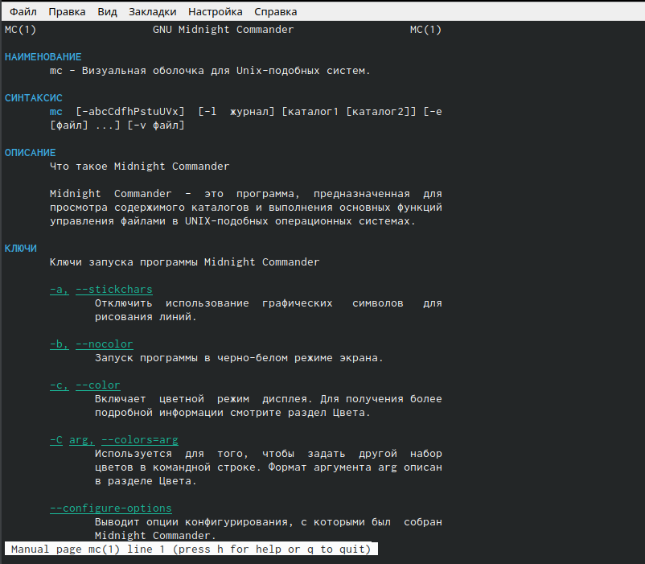
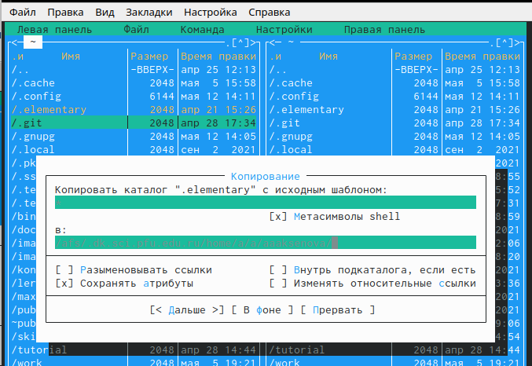
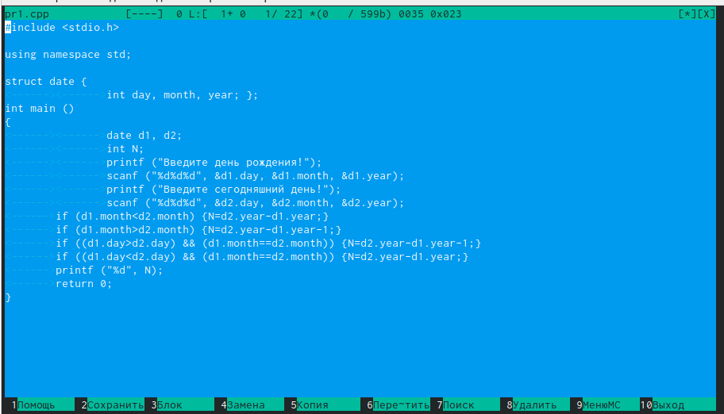

---
## Front matter
lang: ru-RU
title: Лабораторная работа 7
author: |
	Anastaci Aksenov
	
institute: |
	\inst{1}RUDN University, Moscow, Russian Federation
	
date: NEC--2019, 30 September -- 4 October, 2019 Budva, Montenegro

## Formatting
toc: false
slide_level: 2
theme: metropolis
header-includes: 
 - \metroset{progressbar=frametitle,sectionpage=progressbar,numbering=fraction}
 - '\makeatletter'
 - '\beamer@ignorenonframefalse'
 - '\makeatother'
aspectratio: 43
section-titles: true
---

# Выполнение работы

##Команда mc
Изучила информацию о mc, вызвав в командной строке «man mc» . Midnight Commander (или mc) − псевдографическая командная оболочка для UNIX/Linux систем.(рис. -@fig:001 )
{ #fig:001 width=70% }

##Изучение команды mc
Запустила из командной строки mc. В стандартном состояние окно редактора состоит из двух панелей (рис. -@fig:002 ).
{ #fig:02 width=70% }

##Операции в mc
Копирование/перемещение файлов. Для копирования файла используется клавиша «F5» (рис. -@fig:003 ).
{ #fig:003 width=70% }

##Операции в mc
Редактирование содержимого текстового файла (результаты не сохраняем). Перейдем в пункт «Правка» (рис. -@fig:004 ) и изменим имя файла .
{ #fig:004 width=70% }

##Редактирование файла в mc
Открыла файл с исходным текстом на языке программирования С. Открыла файл в редакторе mc с помощью команды «mc» (перед этим выстроила путь к файлу на консоли) (рис. -@fig:005 ).
{ #fig:005 width=70% }

#Выводы
В ходе выполнения данной лабораторной работы я освоила основные возможности командной оболочки Midnigh tCommander и приобрела навыки практической работы по просмотру каталогов и файлов; манипуляций с ними.

## {.standout}

Спасибо всем спасибо
