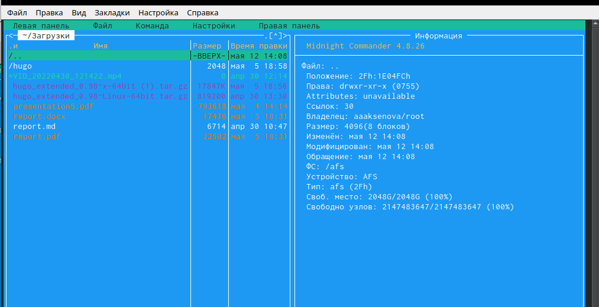

---
## Front matter
title: "Отчет по лабораторной работе 7"
subtitle: "Командная оболочка Midnight Commander"
author: "Аксенова Анастасия"

# Цель работы

Освоение основных возможностей командной оболочки Midnight Commander. Приобретение навыков практической работы по просмотру каталогов и файлов; манипуляций
с ними.

# Задание

7.3.1. Задание по mc

1. Изучите информацию о mc, вызвав в командной строке man mc.
2. Запустите из командной строки mc, изучите его структуру и меню.
3. Выполните несколько операций в mc, используя управляющие клавиши (операции
с панелями; выделение/отмена выделения файлов, копирование/перемещение файлов, получение информации о размере и правах доступа на файлы и/или каталоги
и т.п.)
4. Выполните основные команды меню левой (или правой) панели. Оцените степень
подробности вывода информации о файлах.
5. Используя возможности подменю Файл , выполните:
– просмотр содержимого текстового файла;
– редактирование содержимого текстового файла (без сохранения результатов
редактирования);
– создание каталога;
– копирование в файлов в созданный каталог.
6. С помощью соответствующих средств подменю Команда осуществите:
– поиск в файловой системе файла с заданными условиями (например, файла
с расширением .c или .cpp, содержащего строку main);
– выбор и повторение одной из предыдущих команд;
– переход в домашний каталог;
– анализ файла меню и файла расширений.
7. Вызовите подменю Настройки . Освойте операции, определяющие структуру экрана mc
(Full screen, Double Width, Show Hidden Files и т.д.)ю

7.3.2. Задание по встроенному редактору mc

1. Создайте текстовой файл text.txt.
2. Откройте этот файл с помощью встроенного в mc редактора.
3. Вставьте в открытый файл небольшой фрагмент текста, скопированный из любого
другого файла или Интернета.
4. Проделайте с текстом следующие манипуляции, используя горячие клавиши:
- 4.1. Удалите строку текста.
- 4.2. Выделите фрагмент текста и скопируйте его на новую строку.
- 4.3. Выделите фрагмент текста и перенесите его на новую строку.
- 4.4. Сохраните файл.
- 4.5. Отмените последнее действие.
- 4.6. Перейдите в конец файла (нажав комбинацию клавиш) и напишите некоторый
текст.
- 4.7. Перейдите в начало файла (нажав комбинацию клавиш) и напишите некоторый
текст.
- 4.8. Сохраните и закройте файл.
5. Откройте файл с исходным текстом на некотором языке программирования (например C или Java)
6. Используя меню редактора, включите подсветку синтаксиса, если она не включена,
или выключите, если она включена.

# Выполнение лабораторной работы

1. Изучила информацию о mc, вызвав в командной строке «man mc». Midnight Commander (или mc) − псевдографическая командная оболочка для UNIX/Linux систем. Для запуска mc необходимо в командной строке набрать «mc» и нажать«enter». (рис. [-@fig:001]) (рис. [-@fig:002])
{ #fig:001 width=70% }
{ #fig:001 width=70% }
 
2. Запустила из командной строки mc и изучила его структуру и меню. В стандартном состояние окно редактора состоит из двух панелей. Верхнее меню содержит меню «Левая панель»  (рис. [-@fig:003]), «Файл»  (рис. [-@fig:004]), «Команда»  (рис. [-@fig:005]), «Настройки»  (рис. [-@fig:006]), «Правая панель»  (рис. [-@fig:007]).Нажав клавишу «F2», можно открыть «Меню пользователя» (рис. [-@fig:008]). Нажав клавишу «F1», можно открыть «Помощь» (рис. [-@fig:009]).
{ #fig:003 width=70% }
{ #fig:004 width=70% }
{ #fig:005 width=70% }
{ #fig:006 width=70% }
{ #fig:007 width=70% }
{ #fig:008 width=70% }
{ #fig:009 width=70% }
 
3. Выполнила операции в mc, используя управляющие клавиши

- Выделение/отмена выделения файлов. Использую клавишу «ins» и выделяю необходимые файлы (они выделяются желтым цветом).(рис. [-@fig:010])

{ #fig:010 width=70% }

Для выделения файлов или его отмены можно использовать также команды «Отметить группу», «Снять отметку», «Обратить выделение» в меню «Файл».(рис. [-@fig:011])

{ #fig:011 width=70% }

- Копирование/перемещение файлов. Для копирования файла используется клавиша «F5».(рис. [-@fig:012])

{ #fig:012 width=70% }

- Для перемещения файла использовала клавишу «F6» (рис. [-@fig:013]).

{ #fig:013 width=70% }

 - Получение информации о размере и правах доступа на файлы и/или каталоги. Для получения данной информации можно перейти в команды: «Левая панель» → «Информация» (рис. [-@fig:014]).
 
 { #fig:014 width=70% }

«Левая панель» → «Формат списка» → «Расширенный» (рис. [-@fig:015]).

 { #fig:015 width=70% }

«Файл» → «Права доступа» (рис. [-@fig:016]).

 { #fig:016 width=70% }

«Файл» → «Права (расширенные)» (рис. [-@fig:017]).

 { #fig:017 width=70% }

4). Выполнила основные команды меню правой панели (Скриншот -@fig:025 ).

4.1. Пункт «Список файлов» отображает размер файла и время его правки (рис. [-@fig:018]) (рис. [-@fig:019]).

{ #fig:018 width=70% }
{ #fig:019 width=70% }

4.2. Пункт «Быстрый просмотр» нужен для предпросмотра содержания файла (рис. [-@fig:020]).

{ #fig:020 width=70% }

4.3. Пункт «Информация» отображает подробные данные о файле (рис. [-@fig:021]).

{ #fig:021 width=70% }

4.4. Пункт «Дерево» необходим для просмотра дерева каталога (отображает минимум информации) (рис. [-@fig:022])

{ #fig:022 width=70% }

4.5. Пункт «Формат списка» − «Укороченный» отображает только имя файла или каталога (видна минимальная информация) (рис. [-@fig:023]).

{ #fig:023 width=70% }

4.6. Пункт «Формат списка» − «Расширенный» отображает подробную информацию о файлах, но менее подробную,чем пункт «Информация» (рис. [-@fig:024]).

{ #fig:024 width=70% }

4.7. Пункт «Формат списка» − «Определенный пользователем» предоставляетпользователю возможность самому изменять степень подробности информации о файле, но она будет менее подробной, чем в пункте "Информация".
4.8. Пункт «Формат списка» − «Стандартный» ставится по умолчанию (рис. [-@fig:025]).

{ #fig:025 width=70% }

4.9. Пункт «Порядок сортировки» необходим для сортировки файлов или каталогов по конкретному критерию (рис. [-@fig:026]).

{ #fig:026 width=70% }

4.10. Пункт «Фильтр» необходим, чтобы просматривать название файлов или каталогов, которые подходят под указанную маску(рис. [-@fig:027]).

{ #fig:027 width=70% }

4.11. Пункт "Выбор кодировки" нужен для просмотра и смены кодировки (рис. [-@fig:028]).

{ #fig:028 width=70% }

5). Используя возможности под меню «Файл» (см. рис. -@fig:038), выполним:

5.1. Просмотр содержимого текстового файла. Выберем текстовый файл и перейдем в пункт «Просмотр» (рис. [-@fig:029]).
{ #fig:029 width=70% }

5.2. Редактирование содержимого текстового файла (результаты не сохраняем). Перейдем в пункт «Правка»  и изменим имя файла (рис. [-@fig:030]).
{ #fig:030 width=70% }

5.3. Создание каталога. Перешла в пункт «Создание каталога» и создала каталог(рис. [-@fig:031]).
{ #fig:031 width=70% }

5.4. Копирование файлов в созданный каталог. Для этого, используя клавишу «ins», выделила несколько файлов (рис. [-@fig:032]).
{ #fig:032 width=70% }

После этого выбрав пункт «Копирование», скопируем данные файлы в созданный каталог

6). Используя соответствующие средства под меню «Команда» (Скриншот -@fig:046 ) осуществим:

6.1. Поиск в файловой системе файла с заданными условиями. Перешла в пункт «Поиск файла» и задала следующие параметры: «От каталога» /,«Шаблон имени» *.с, «Содержимое» main и осуществила поиск нужных файлов.(рис. [-@fig:033])
{ #fig:033 width=70% }

Аналогичным образом найшла файлы с шаблоном имени *.cpp (рис. [-@fig:034])(рис. [-@fig:035]).

{ #fig:034 width=70% }
{ #fig:035 width=70% }

6.2. Выбор и повторение одной из предыдущих команд. Перешла в пункт «История командной строки» и увидила, что внизу экрана появилась сноска «История», но т.к.командная строка не была использована эта сноска пустая .

6.3. Переход в домашний каталог. Для перехода в домашний каталог перешла в пункт «Дерево каталогов», выбрала необходимый каталог и нажала «enter», в результате чего, в левой панели перешла в домашний каталог.(рис. [-@fig:036])

{ #fig:036 width=70% }

6.4. Анализ файла меню и файла расширений. Перешла в пункт «Редактировать файл расширений» . "Редактировать файл расширений" − позволяет задать с помощью определённого синтаксиса действия при запуске файлов с определённым расширением. Пункт «Редактировать файл меню» − позволяет отредактировать контекстное меню пользователя (рис. [-@fig:037]).
{ #fig:037 width=70% }

7). Вызвала под меню «Настройки».Освоила операции, определяющие структуру экрана mc:(рис. [-@fig:038])
{ #fig:038 width=70% }

7.1. Перешла в пункт «Конфигурац. Этот пункт позволяет скорректировать настройки работы с панелями.(рис. [-@fig:039])
{ #fig:039 width=70% }

7.2. Перешла в пункт «Внешний вид»  ,а затем в пункт «Настройки панелей» . Данные пункты определяют элементы (строка меню,командная строка,подсказк и ипрочее), отображаемые при вызове mc,а также геометрию расположения панелей и цветовыделение.(рис. [-@fig:040])(рис. [-@fig:041])
{ #fig:040 width=70% }
{ #fig:041 width=70% }

7.3. Перешла в пункт «Подтверждение».Этот пункт позволяет установить или убрать вывод окна с запросом подтверждения действий при операциях удаления и перезаписи файлов, атакже при выходе из программы.(рис. [-@fig:042])
{ #fig:042 width=70% }

7.4. Перешла в пункт «Оформление» (рис. [-@fig:043]). Данный пункт позволяет поменять цветовую гамму визуальной оболочки для комфортной работы.
{ #fig:043 width=70% }

7.5. Перешла в пункт «Биты символов» (рис. [-@fig:044]). Этот пункт задаёт формат обработки информации локальным терминалом.
{ #fig:044 width=70% }

7.6. Перешла в пункт «Распознавание клавиш» (рис. [-@fig:045]). Данное диалоговое окно используется для тестирования функциональных клавиш, клавишу правления курсором и прочее.
{ #fig:045 width=70% }

7.7. Перешла в пункт «Виртуальные ФС» (рис. [-@fig:046]).Это настройки виртуальной файловой системы: тайм-аут,пароль и прочее.
{ #fig:046 width=70% }

7.8. Перешла в пункт «Сохранить настройки» (рис. [-@fig:047]).Данный пункт сохранит все изменения.
{ #fig:047 width=70% }

Задание 2 (работа с редактором mc)

1). С помощью команды «touch text.txt» создаем текстовой файл text.txt. Командой« ls» проверяем правильность выполненных действий. (рис. [-@fig:048])
{ #fig:048 width=70% }

2) Открываем этот файл с помощью встроенного mc редактора командой «mcedit text.txt».
3). Вставила в открытый файл небольшой фрагмент текста, скопированный из Интернета (рис. [-@fig:049])
{ #fig:049 width=70% }

4).Выполним следующие действия:

4.1. Удалим 4-ю строку текста с помощью клавиши «F8» (рис. [-@fig:050]).
{ #fig:050 width=70% }

4.2. Выделила фрагмент текста, нажав «F3» для начала выделения текста и для его окончания, и скопировала его на новую строку, используя клавишу «F5» (рис. [-@fig:051]).
{ #fig:051 width=70% }

4.3. Выделила фрагмент текста и перенесла его на новую строку с помощью клавиши «F6» (рис. [-@fig:052])
{ #fig:052 width=70% }

4.4. Сохранила файл, нажав «F2» (рис. [-@fig:053]).
{ #fig:053 width=70% }

4.5. Отменила последнее действие с помощью сочетания клавиш «ctrl»+«u» (рис. [-@fig:054]).
{ #fig:054 width=70% }

4.6. Перешла в конец файла, нажав клавиши «ctrl»+«end» (переход в конец файла) и написала следующий текст «песня леди баг» (рис. [-@fig:055]).
{ #fig:055 width=70% }

4.7. Перешла в начало файла, нажав клавиши «ctrl»+«home» (переход в начало файла) и написала следующий текст «Стихотворение про осень:» (рис. [-@fig:056]).
{ #fig:056 width=70% }

4.8. Выполнила сохранение файла (клавиша «F2») и выйдем из него (клавиша «F10»)

5). Открыла файл с исходным текстом на языке программирования С. Открыла файл в редакторе mc с помощью команды «mc» (перед этим выстроила путь к файлу на консоли)

6). Используя меню редактора «Команда» → «Включить/выключить подсветку синтаксиса», выключим подсветку синтаксиса (рис. [-@fig:057]).
{ #fig:057 width=70% }

#Ответы на контрольные вопросы:

Панели могут дополнительно быть переведены в один из двух режимов: «Информация» или «Дерево». В режиме «Информация» на панель выводятся сведения о файле и текущей файловой системе, расположенных на активной панели. В режиме «Дерево» на одной из панелей выводится структура дерева каталогов.

Как с помощью команд shell, так и с помощью меню (комбинаций клавиш) mc можно выполнить следующие операции с файлами:

копирование «F5» («cp имя_файла имя_каталога (в который копируем)») (Рисунок14)

перемещение/переименование «F6» («mv имя_файла имя_каталога (в который перемещаем)»)(Рисунок15)

создание каталога «F7» («mkdir имя_каталога»)(Рисунок38)

удаление «F8» («rm имя_файла»)

изменение прав доступа «ctrl+x» («chmod u+x имя_файла»)

Перейти в строку меню панелей mc можно с помощью функциональной клавиши «F9». В строке меню имеются пять меню: «Леваяпанель», «Файл», «Команда», «Настройки» и «Праваяпанель».
Под пункт меню «Быстрый просмотр» позволяет выполнить быстрый просмотр содержимого панели.

Подпункт меню «Информация» позволяет посмотреть информацию о файле или каталоге. В меню каждой (левой или правой) панели можно выбрать «Формат списка»:

стандартный − выводит список файлов и каталогов с указанием размера и времени правки;

ускоренный − позволяет задать число столбцов, на которые разбивается панель при выводе списка имён файлов или каталогов без дополнительной информации;

расширенный − помимо названия файла или каталога выводит сведения о правах доступа, владельце, группе, размере, времени правки;

определённый пользователем − позволяет вывести те сведения о файле или каталоге, которые задаст сам пользователь.

Подпункт меню «Порядок сортировки» позволяет задать критерии сортировки при выводе списка файлов и каталогов: без сортировки, по имени, расширенный, время правки, время доступа, время изменения атрибута, размер, узел.

Команды меню «Файл»:
Просмотр(«F3»)− позволяет посмотреть содержимое текущего (или выделенного) файла без возможности редактирования.

Просмотр вывода команды («М»+«!»)− функция запроса команды с параметрами (аргумент к текущему выбранному файлу).

Правка(«F4») − открывает текущий (или выделенный) файл для его редактирования.

Копирование(«F5»)− осуществляет копирование одного или нескольких файлов или каталогов в указанное пользователем во всплывающем окне место.

Права доступа («Ctrl-x»«c»)− позволяет указать (изменить) права доступа к одному или нескольким файлам или каталогам.

Жёсткая ссылка («Ctrl-x»«l»)− позволяет создать жёсткую ссылку к текущему(или выделенному) файлу.

Символическая ссылка («Ctrl-x»«s»)− позволяет создать символическую ссылку к текущему (или выделенному) файлу.

Владелец/группа («Ctrl-x»«o»)− позволяет задать (изменить) владельца и имя группы для одного или нескольких файлов или каталогов.

Права(расширенные)− позволяет изменить права доступа и владения для одного или нескольких файлов или каталогов.

Переименование («F6»)− позволяет переименовать (или переместить) один или несколько файлов или каталогов.

Создание каталога («F7») − позволяет создать каталог.

Удалить («F8») − позволяет удалить один или несколько файлов или каталогов.

Выход («F10») − завершает работу mc.

Меню Команда
В меню Команда содержатся более общие команды для работы с mc.

Команды меню Команда:

Дерево каталогов − отображает структуру каталогов системы.

Поиск файла − выполняет поиск файлов по заданным параметрам.

Переставить панели − меняет местами левую и правую панели.

Сравнить каталоги («Ctrl-x»«d») − сравнивает содержимое двух каталогов.

Размеры каталогов − отображает размер и время изменения каталога (по умолчанию в mc размер каталога корректно не отображается).

История командной строки − выводит на экран список ранее выполненных в оболочке команд.

Каталоги быстрого доступа(Ctrl-\»)− при вызове выполняется быстрая смена текущего каталога на один из заданного списка.

Восстановление файлов − позволяет восстановить файлы на файловых системах ext2 и ext3.

Редактировать файл расширений − позволяет задать с

Елизавета Пермякова, вчера в 20:21 помощью определённого синтаксиса действия при запуске файлов с определённым расширением (например, какое программное обеспечение запускать для открытия или редактирования файлов с расширением doc или docx).

Редактировать файл меню − позволяет отредактировать контекстное меню пользователя, вызываемое по клавише «F2».

Редактировать файл расцветки имён − позволяет подобрать оптимальную для пользователя расцветку имён файлов в зависимости от их типа.

Меню Настройки содержит ряд дополнительных опций по внешнему виду и функциональности mc.
Меню Настройки содержит:

Конфигурация − позволяет скорректировать настройки работы с панелями.

Внешний вид и Настройки панелей − определяет элементы (строка меню, командная строка, подсказки и прочее), отображаемые при вызове mc, а также геометрию расположения панелей и цветовыделение.

Биты символов − задаёт формат обработки информации локальным терминалом.

Подтверждение − позволяет установить или убрать вывод окна с запросом подтверждения действий при операциях удаления и перезаписи файлов, а также при выходе из программы.

Распознание клавиш − диалоговое окно используется для тестирования функциональных клавиш, клавиш управления курсором и прочее.

Виртуальные ФС − настройки виртуальной файловой системы: тайм-аут, пароль и прочее.

Функциональные клавиши mc:
F1 – вызов контекстно-зависимой подсказки

F2 – вызов пользовательского меню с возможностью создания и/или дополнения дополнительных функций

F3 – просмотр содержимого файла, на который указывает подсветка в активной панели (без возможности редактирования)

F4 – вызов встроенного в mc редактора для изменения содержания файла, на который указывает подсветка в активной панели

F5 – копирование одного или нескольких файлов, отмеченных впервой (активной) панели, в каталог, отображаемый на второй панели

F6 – перенос одного или нескольких файлов, отмеченных в первой (активной) панели, в каталог, отображаемый на второй панели

F7 – создание подкаталога в каталоге, отображаемом в активной панели

F8 – удаление одного или нескольких файлов (каталогов), отмеченных в первой (активной) панели файлов

F9 – вызов меню mc

F10 – выход из mc

Встроенный в mc редактор вызывается с помощью функциональной клавиши «F4». В нём удобно использовать различные комбинации клавиш при редактировании содержимого (как правило текстового) файла. Клавиши для редактирования файла:
«Ctrl-y» − удалить строку

«Ctrl-u» − отмена последней операции

«ins» - вставка/замена

«F7» − поиск (можно использовать регулярные выражения)

«↑-F7» − повтор последней операции поиска

«F4» − замена

«F3» − первое нажатие − начало выделения, второе − окончание выделения

«F5» − копировать выделенный фрагмент

«F6» − переместить выделенный фрагмент

«F8» − удалить выделенный фрагмент

«F2» − записать изменения в файл

«F10» − выйти из редактор

Для редактирования меню пользователя, которое вызывается клавишей «F2», необходимо перейти в пункт «Редактировать файл меню» → «Команда» и изменить настройки файла.

Часть команд «Меню пользователя», а также меню «Файл» позволяют выполнять действия, определяемые пользователем, над текущим файлом. Например, копирование каталога или файла, переименование, перемещение, архивирование.

# Выводы

В ходе выполнения данной лабораторной работы я освоила основные возможности командной оболочки Midnigh tCommander и приобрела навыки практической работы по просмотру каталогов и файлов; манипуляций с ними.

