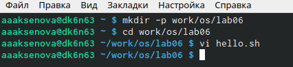
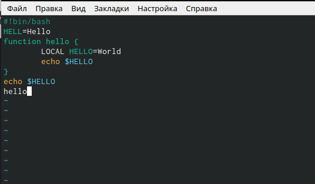
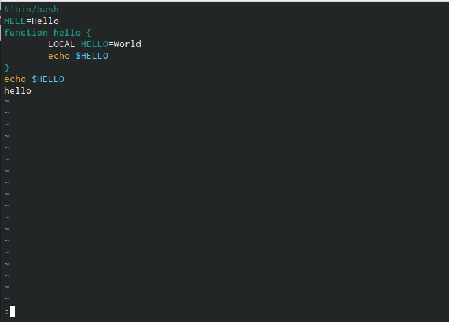
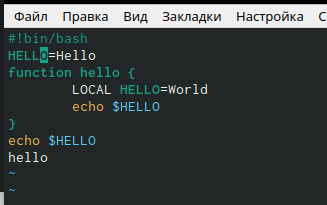
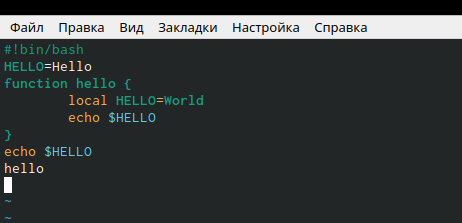

---
## Front matter
lang: ru-RU
title: Лабораторная работа 8
author: |
	Aksenov Anactia\inst{1,3}
	
institute: |
	\inst{1}RUDN University, Moscow, Russian Federation
	
date: 13 May, 2022 

## Formatting
toc: false
slide_level: 2
theme: metropolis
header-includes: 
 - \metroset{progressbar=frametitle,sectionpage=progressbar,numbering=fraction}
 - '\makeatletter'
 - '\beamer@ignorenonframefalse'
 - '\makeatother'
aspectratio: 43
section-titles: true
---

# Текстовой редактор vi

## Создание каталога
Создала каталог с именем ~/work/os/lab06 с помощью команды mkdir.  (рис. [-@fig:001])

{ #fig:001 width=70% } 

##Работа с текстом в редакторе
Нажимаем клавишу «i» и вводим текст, указанный в лабораторной работе. (рис. [-@fig:002])

{ #fig:002 width=70% }

##Работа с текстом в редакторе
Нажимаем «:» для перехода в режим последней строки, появилось приглашение в виде двоеточия. (рис. [-@fig:003])

{ #fig:003 width=70% }

##Работа с текстом в редакторе
Перешла в режим вставки, нажав на клавишу «i», и заменила HELL на HELLO, дописав O. (рис. [-@fig:004])

{ #fig:004 width=70% }

##Работа с текстом в редакторе
Удалила последнюю строку, используя комбинацию клавиш «d» и «d». (рис. [-@fig:005]) 

{ #fig:005 width=70% }

##Выводы
В ходе лабораторной работы я познакомилась с операционной системой Linux. Получила практические навыки работы с редактором vi, установленным по умолчанию практически во всех дистрибутивах.

## {.standout}

Спасибо всем спасибо
