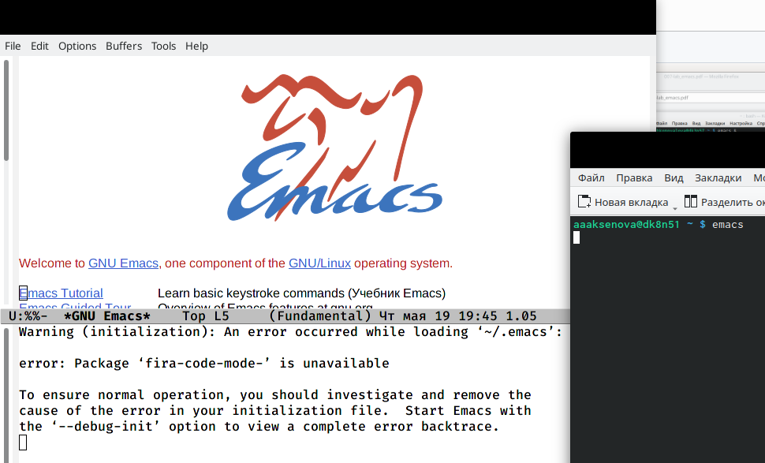
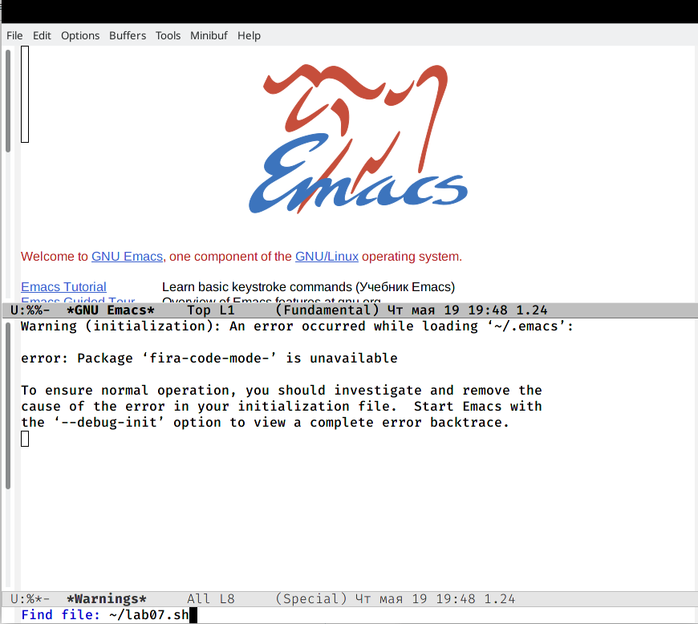
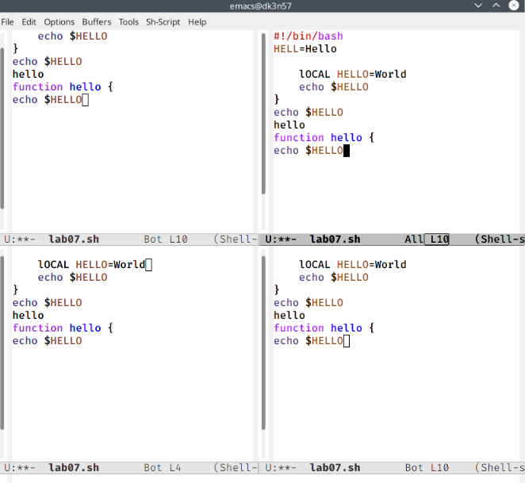
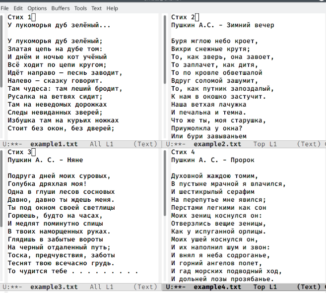
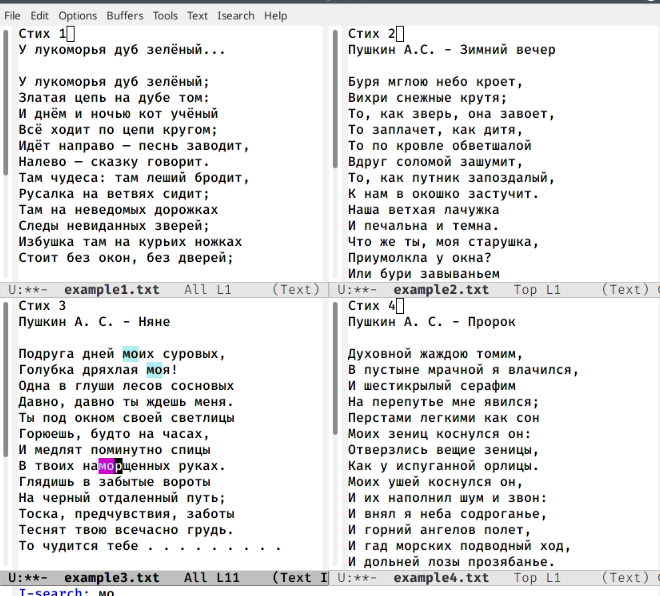

---
## Front matter
lang: ru-RU
title: Structural approach to the deep learning method
author: |
	Aksenova Anastasia\inst{1,3}
	
institute: |
	\inst{1}RUDN University, Moscow, Russian Federation
	
date: NEC--2022, 19 May

## Formatting
toc: false
slide_level: 2
theme: metropolis
header-includes: 
 - \metroset{progressbar=frametitle,sectionpage=progressbar,numbering=fraction}
 - '\makeatletter'
 - '\beamer@ignorenonframefalse'
 - '\makeatother'
aspectratio: 43
section-titles: true
---

# Лабораторная работа 9. Текстовой редактор emacs

## Текстовой редактор emacs

Открыла редактор Emacs с помощью команды «emacs &» (рис. [-@fig:001])
{ #fig:001 width=70% }

## Текстовой редактор emacs

Создала файл lab07.sh с помощью комбинации «Ctrl-x» «Ctrl-f» (рис. [-@fig:002])
{ #fig:002 width=70% }

## Работа с фреймом

Поделила фрейм на 4 части (команда «Ctrl-x 3») (рис. [-@fig:003])
{ #fig:003 width=70% }

## Режим поиска

Переключилась в режим поиска («Ctrl-s») 

{ #fig:004 width=70% }

## Режим поиска

Переключилась между результатами поиска

{ #fig:005 width=70% }

## Выводы

В ходе выполнения данной лабораторной работы я познакомилась с операционной системой Linux и получила практические навыки работы с редактором Emacs.

## {.standout}

Wer's nicht glaubt, bezahlt einen Taler
