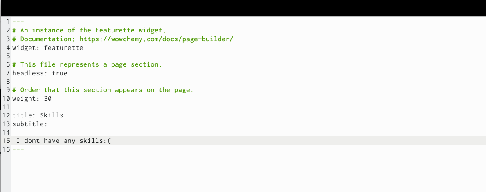
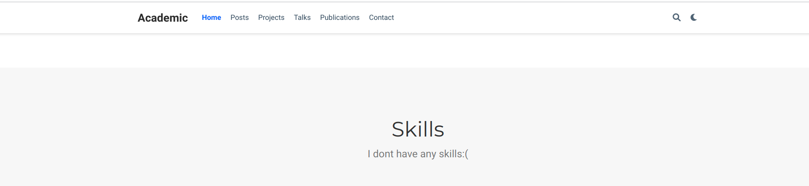
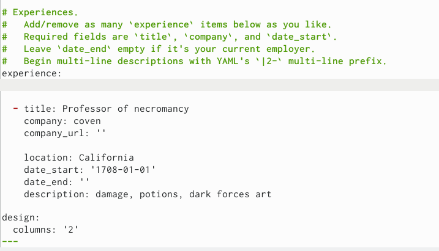
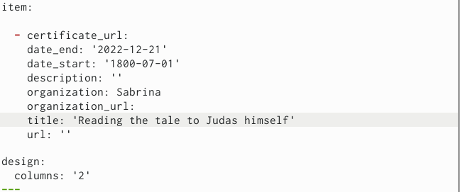
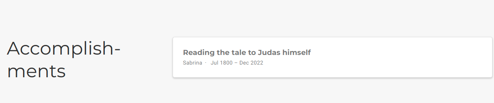
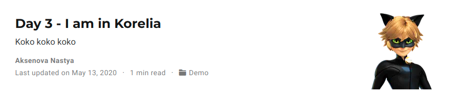
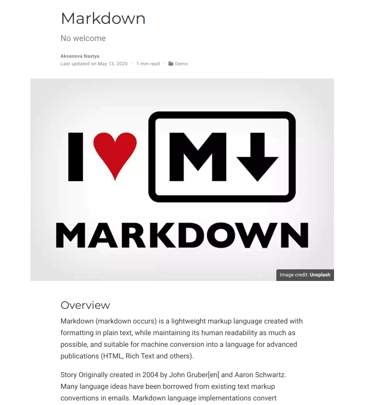

---
## Front matter
lang: ru-RU
title: Structural approach to the deep learning method
author: |
	Aksyonova Nastya\inst{1,3}
	
institute: |
	\inst{1}RUDN University, Moscow, Russian Federation
	
date: NEC--2022, 13 May

## Formatting
toc: false
slide_level: 2
theme: metropolis
header-includes: 
 - \metroset{progressbar=frametitle,sectionpage=progressbar,numbering=fraction}
 - '\makeatletter'
 - '\beamer@ignorenonframefalse'
 - '\makeatother'
aspectratio: 43
section-titles: true
---

# 3 этап проекта

# Сначала я добавила информацию о навыках (Skills).  

{ #fig:001 width=70% }
{ #fig:002 width=70% }

# Потом я добавила информацию об опыте (Experience).  

{ #fig:003 width=70% }
{ #fig:004 width=70% }

# Добавила информацию о достижениях (Accomplishments).   

{ #fig:005 width=70% }
{ #fig:006 width=70% }

# Сделала пост по прошедшей неделе.  
{ #fig:007 width=70% }

# Добавила пост на тему по выбору (Язык разметки Markdown.)  
{ #fig:008 width=70% }

# Выводы

Мы добавили достижения и выложили 2 поста.

## {.standout}

Wer's nicht glaubt, bezahlt einen Taler
