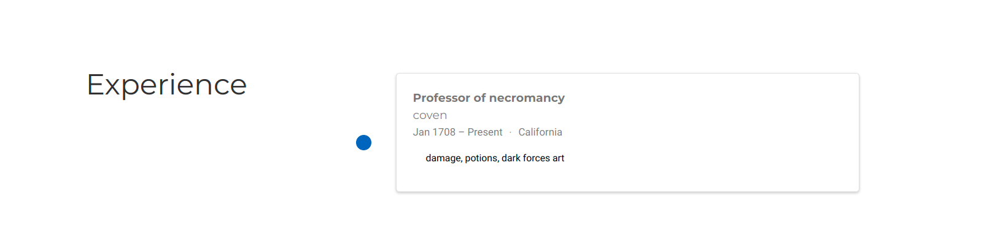

---
## Front matter
title: "Отчет по 3 этапу проекта"
subtitle: ""
author: "Аксенова Анастасия"

# Цель работы

Потихоньку делаем сайт

# Задание

Добавить к сайту достижения.

Список достижений.
Добавить информацию о навыках (Skills).
Добавить информацию об опыте (Experience).
Добавить информацию о достижениях (Accomplishments).
Сделать пост по прошедшей неделе.
Добавить пост на тему по выбору:
Легковесные языки разметки.
Языки разметки. LaTeX.
Язык разметки Markdown.

# Ход работы:

1) Сначала я добавила информацию о навыках (Skills).  (рис. [-@fig:001])  (рис. [-@fig:002])

{ #fig:001 width=70% }
{ #fig:002 width=70% }

2) Потом я добавила информацию об опыте (Experience).  (рис. [-@fig:003])  (рис. [-@fig:004])

{ #fig:003 width=70% }
{ #fig:004 width=70% }

3) Добавила информацию о достижениях (Accomplishments).  (рис. [-@fig:005])  (рис. [-@fig:006])

{ #fig:005 width=70% }
{ #fig:006 width=70% }

4) Сделала пост по прошедшей неделе.  (рис. [-@fig:007])
{ #fig:007 width=70% }

5) Добавила пост на тему по выбору (Язык разметки Markdown.)  (рис. [-@fig:008])
{ #fig:008 width=70% }

# Выводы

Мы добавили достижения и выложили 2 поста.

