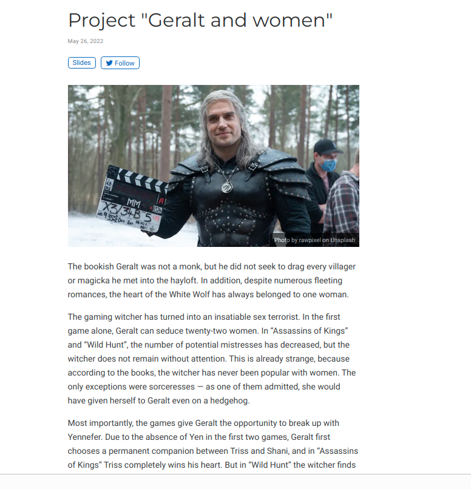
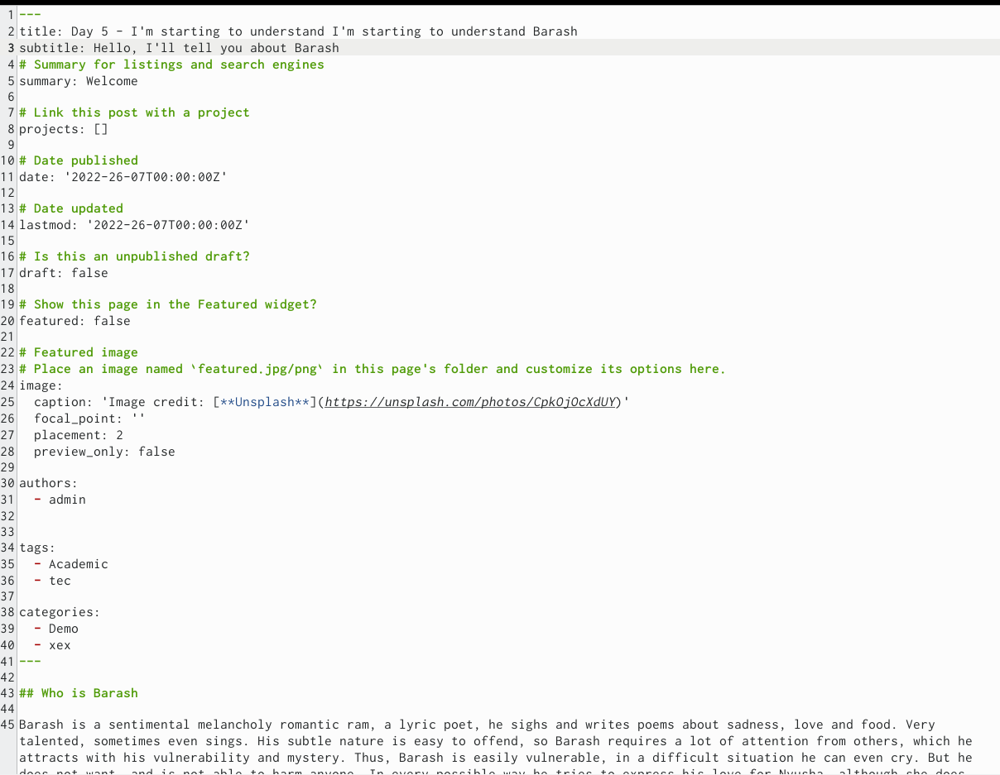
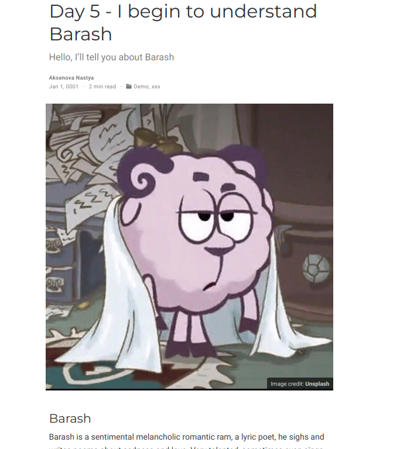
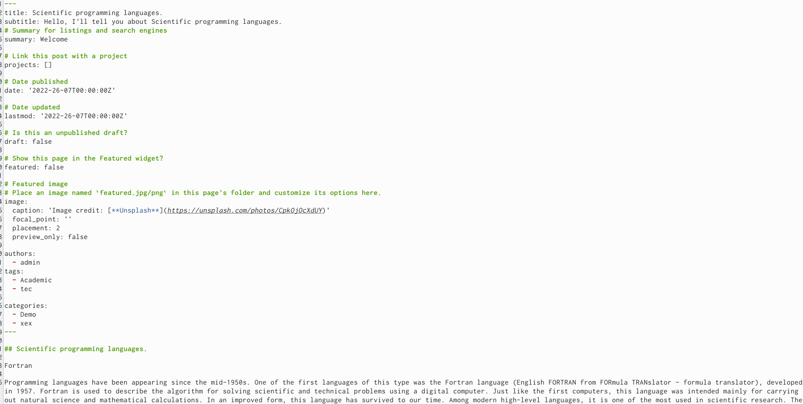
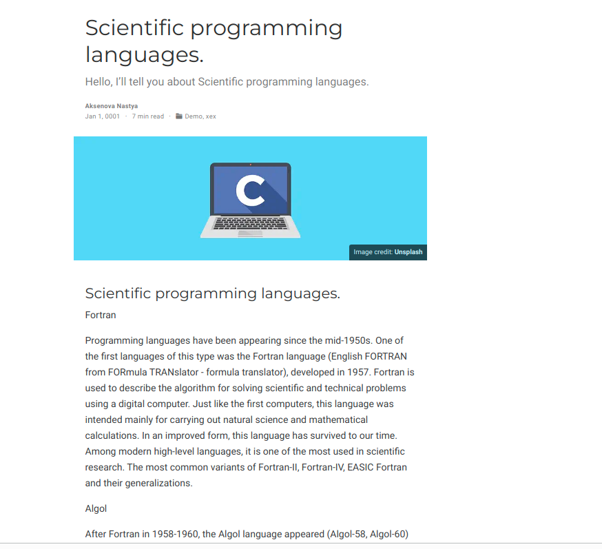

---
## Front matter
lang: ru-RU
title: Отчет по 5 этапу проекта
author: |
	Аксенова Анастасия\inst{1,3}
	
institute: |
	\inst{1}RUDN University, Moscow, Russian Federation
	
date: NEC--2022, 26 May

## Formatting
toc: false
slide_level: 2
theme: metropolis
header-includes: 
 - \metroset{progressbar=frametitle,sectionpage=progressbar,numbering=fraction}
 - '\makeatletter'
 - '\beamer@ignorenonframefalse'
 - '\makeatother'
aspectratio: 43
section-titles: true
---

# Отчет по 5 этапу проекта

## Сначала я сделала запись для персонального проекта.  (рис. [-@fig:001])  (рис. [-@fig:002])

{ #fig:001 width=70% }

## Потом сделала пост по прошедшей неделе. (рис. [-@fig:003])  (рис. [-@fig:004])

{ #fig:002 width=70% }
{ #fig:003 width=70% }

## Добавила пост на тему по выбору(Языки научного программирования).  (рис. [-@fig:005])

{ #fig:004 width=70% } 
{ #fig:005 width=70% }

## {.standout}

Спасибо всем спасибо
